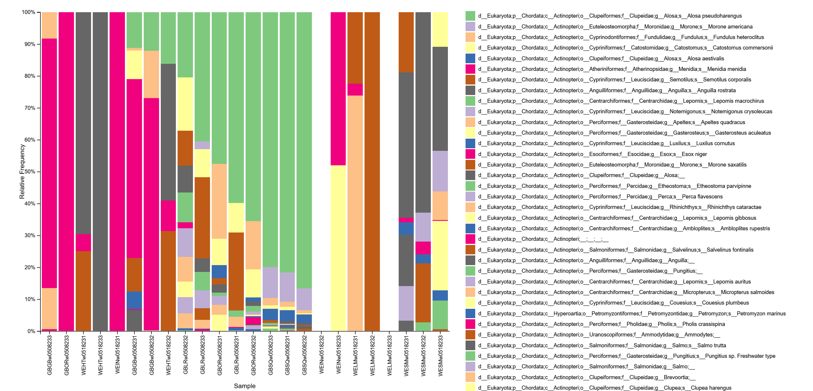
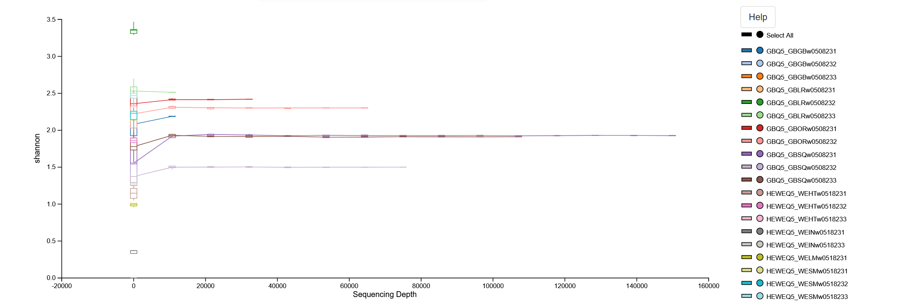
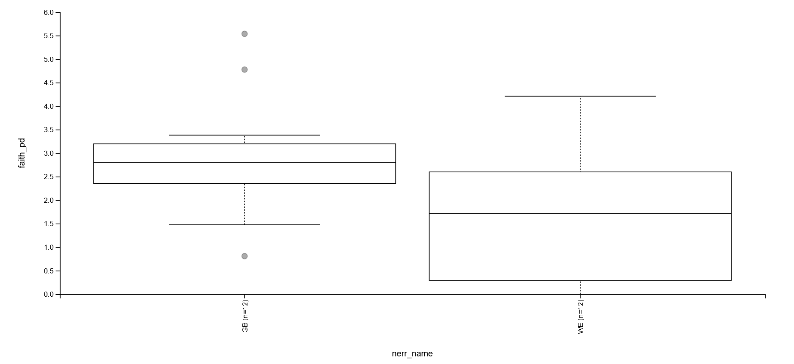

# gen_final_proj

## Study Background

   This study used samples taken from multiple different sources such as the Lamprey river, Oyster River, and the Squamscott River. and analyzed through eDNA metabarcoding.
   Metabarcoding is taking samples from the environment where DNA can be extracted and then amplifying it to readable levels using PCR primers.
   This study compared fish species using the MiFish locus (or 12s) primers which are designed specifically for marine species.
   The data was analyzed using qiime2.

## Methods

code:

mkdir final-proj 

cp -R /tmp/gen711_project_data/eDNA-fqs/mifish/fastqs/ /home/users/maf1092/final-proj

cp /tmp/gen711_project_data/eDNA-fqs/mifish/GreatBay-Metadata.tsv /home/users/maf1092/final-proj

cp /tmp/gen711_project_data/eDNA-fqs/mifish/Wells-Metadata.tsv /home/users/maf1092/final-proj

cp /tmp/new_meta.tsv /home/users/maf1092/final-proj

cd final-proj/

mkdir ref-database

cp /tmp/gen711_project_data/eDNA-fqs/mifish/ref-database/mitofish-classifier.qza /home/users/maf1092/final-proj/ref-database/2mitofish-classifier.qza

mkir trimmed_fastqs

## Filter Raw Reads

qiime tools import \
   --type "SampleData[PairedEndSequencesWithQuality]"  \
   --input-format CasavaOneEightSingleLanePerSampleDirFmt \
   --input-path /home/users/maf1092/final-proj/fastqs/GreatBay \
   --output-path /home/users/maf1092/final-proj/trimmed_fastqs/trimmed_GreatBay

qiime tools import \
   --type "SampleData[PairedEndSequencesWithQuality]"  \
   --input-format CasavaOneEightSingleLanePerSampleDirFmt \
   --input-path /home/users/maf1092/final-proj/fastqs/Wells \
   --output-path /home/users/maf1092/final-proj/trimmed_fastqs/trimmed_Wells

qiime cutadapt trim-paired \
    --i-demultiplexed-sequences /home/users/maf1092/final-proj/trimmed_fastqs/trimmed_GreatBay.qza \
    --p-cores 4 \
    --p-front-f GTCGGTAAAACTCGTGCCAGC \
    --p-front-r CATAGTGGGGTATCTAATCCCAGTTTG \
    --p-discard-untrimmed \
    --p-match-adapter-wildcards \
    --verbose \
    --o-trimmed-sequences /home/users/maf1092/final-proj/trimmed_fastqs/clean-trimmed_GreatBay.qza

qiime cutadapt trim-paired \
    --i-demultiplexed-sequences /home/users/maf1092/final-proj/trimmed_fastqs/trimmed_Wells.qza \
    --p-cores 4 \
    --p-front-f GTCGGTAAAACTCGTGCCAGC \
    --p-front-r CATAGTGGGGTATCTAATCCCAGTTTG \
    --p-discard-untrimmed \
    --p-match-adapter-wildcards \
    --verbose \
    --o-trimmed-sequences /home/users/maf1092/final-proj/trimmed_fastqs/clean-trimmed_Wells.qza

qiime demux summarize \
    --i-data /home/users/maf1092/final-proj/trimmed_fastqs/clean-trimmed_GreatBay.qza \
    --o-visualization  /home/users/maf1092/final-proj/trimmed_fastqs/demux-summ_GreatBay.qzv 

qiime demux summarize \
    --i-data /home/users/maf1092/final-proj/trimmed_fastqs/clean-trimmed_Wells.qza \
    --o-visualization  /home/users/maf1092/final-proj/trimmed_fastqs/demux-summ_Wells.qzv

mkdir denoising

## Denoising

qiime dada2 denoise-paired \
    --i-demultiplexed-seqs /home/users/maf1092/final-proj/trimmed_fastqs/clean-trimmed_GreatBay.qza  \
    --p-trunc-len-f  120 \
    --p-trunc-len-r 115 \
    --p-trim-left-f 0 \
    --p-trim-left-r 0 \
    --p-n-threads 4 \
    --o-denoising-stats /home/users/maf1092/final-proj/denoising/denoising_GreatBay.qza \
    --o-table /home/users/maf1092/final-proj/denoising/feature_table_GreatBay.qza \
    --o-representative-sequences /home/users/maf1092/final-proj/denoising/rep-seqs_GreatBay.qza

qiime dada2 denoise-paired \
    --i-demultiplexed-seqs /home/users/maf1092/final-proj/trimmed_fastqs/clean-trimmed_Wells.qza  \
    --p-trunc-len-f  120 \
    --p-trunc-len-r 115 \
    --p-trim-left-f 0 \
    --p-trim-left-r 0 \
    --p-n-threads 4 \
    --o-denoising-stats /home/users/maf1092/final-proj/denoising/denoising_Wells.qza \
    --o-table /home/users/maf1092/final-proj/denoising/feature_table_Wells.qza \
    --o-representative-sequences /home/users/maf1092/final-proj/denoising/rep-seqs_Wells.qza

qiime metadata tabulate \
    --m-input-file /home/users/maf1092/final-proj/denoising/denoising_GreatBay.qza \
    --o-visualization /home/users/maf1092/final-proj/denoising/denoising_GreatBay.qzv

qiime metadata tabulate \
    --m-input-file /home/users/maf1092/final-proj/denoising/denoising_Wells.qza \
    --o-visualization /home/users/maf1092/final-proj/denoising/denoising_Wells.qzv

qiime feature-table tabulate-seqs \
        --i-data /home/users/maf1092/final-proj/denoising/rep-seqs_GreatBay.qza \
        --o-visualization /home/users/maf1092/final-proj/denoising/rep-seqs_GreatBay.qzv

qiime feature-table tabulate-seqs \
        --i-data /home/users/maf1092/final-proj/denoising/rep-seqs_Wells.qza \
        --o-visualization /home/users/maf1092/final-proj/denoising/rep-seqs_Wells.qzv

cd /home/users/maf1092/final-proj/

mkdir taxonomy merged-data

## Taxonomy

qiime feature-table merge-seqs \
   --i-data /home/users/maf1092/final-proj/denoising/rep-seqs_GreatBay.qza \
   --i-data /home/users/maf1092/final-proj/denoising/rep-seqs_Wells.qza \
   --o-merged-data /home/users/maf1092/final-proj/merged-data/BOTH_rep-seqs.qza

qiime feature-table merge \
  --i-tables /home/users/maf1092/final-proj/denoising/feature_table_GreatBay.qza \
  --i-tables /home/users/maf1092/final-proj/denoising/feature_table_Wells.qza \
  --o-merged-table /home/users/maf1092/final-proj/merged-data/combined_feature_table.qza

qiime feature-classifier classify-sklearn \
  --i-classifier  /home/users/maf1092/final-proj/ref-database/2mitofish-classifier.qza \
  --i-reads /home/users/maf1092/final-proj/merged-data/BOTH_rep-seqs.qza \
  --o-classification /home/users/maf1092/final-proj/taxonomy/classify-sklearn-taxonomy

## Barplot and Charts

mkdir new-barplot new-phylo-tree

qiime taxa barplot \
     --i-table /home/users/maf1092/final-proj/merged-data/combined_feature_table.qza \
     --i-taxonomy /home/users/maf1092/final-proj/taxonomy/classify-sklearn-taxonomy.qza \
     --o-visualization /home/users/maf1092/final-proj/new-barplot/BOTH-barplot.qzv

qiime feature-table filter-samples \
  --i-table /home/users/maf1092/final-proj/merged-data/combined_feature_table.qza \
  --m-metadata-file /home/users/maf1092/final-proj/new_meta.tsv \
  --o-filtered-table /home/users/maf1092/final-proj/merged-data/combined_filter_feature_table.qza

qiime phylogeny align-to-tree-mafft-fasttree \
  --i-sequences /home/users/maf1092/final-proj/merged-data/BOTH_rep-seqs.qza \
  --o-alignment /home/users/maf1092/final-proj/new-phylo-tree/alignments \
  --o-masked-alignment /home/users/maf1092/final-proj/new-phylo-tree/masked-alignment \
  --o-tree /home/users/maf1092/final-proj/new-phylo-tree/unrooted-tree \
  --o-rooted-tree /home/users/maf1092/final-proj/new-phylo-tree/rooted-tree \
  --p-n-threads 4

qiime diversity core-metrics-phylogenetic \
  --i-phylogeny /home/users/maf1092/final-proj/new-phylo-tree/rooted-tree.qza \
  --i-table /home/users/maf1092/final-proj/merged-data/combined_filter_feature_table.qza \
  --p-sampling-depth 500 \
  --m-metadata-file /home/users/maf1092/final-proj/new_meta.tsv  \
  --p-n-jobs-or-threads 4 \
  --output-dir core-metrics

qiime diversity alpha-phylogenetic \
  --i-table /home/users/maf1092/final-proj/merged-data/combined_filter_feature_table.qza \
  --i-phylogeny /home/users/maf1092/final-proj/new-phylo-tree/rooted-tree.qza \
  --p-metric faith_pd \
  --o-alpha-diversity /home/users/maf1092/final-proj/new-phylo-tree/core-metrics/faith_pd

qiime diversity alpha-rarefaction \
    --i-table /home/users/maf1092/final-proj/merged-data/combined_filter_feature_table.qza \
    --i-phylogeny /home/users/maf1092/final-proj/new-phylo-tree/rooted-tree.qza \
    --p-max-depth 150000 \
    --m-metadata-file /home/users/maf1092/final-proj/new_meta.tsv  \
    --p-min-depth 100 \
    --p-steps 15 \
    --o-visualization /home/users/maf1092/final-proj/new-phylo-tree/core-metrics/alpha-rarefaction

qiime diversity alpha-group-significance \
    --i-alpha-diversity /home/users/maf1092/final-proj/new-phylo-tree/core-metrics/faith_pd.qza \
    --m-metadata-file /home/users/maf1092/final-proj/new_meta.tsv  \
    --o-visualization /home/users/maf1092/final-proj/new-phylo-tree/core-metrics/alpha-group-significance

## Table in Excel

qiime tools export \
  --input-path /home/users/maf1092/final-proj/taxonomy/classify-sklearn-taxonomy.qza \
  --output-path /home/users/maf1092/final-proj/tables/

qiime tools export \
  --input-path /home/users/maf1092/final-proj/merged-data/combined_filter_feature_table.qza \
  --output-path /home/users/maf1092/final-proj/tables/

biom add-metadata \
  --input-fp /home/users/maf1092/final-proj/tables/feature-table.biom \
  -o /home/users/maf1092/final-proj/tables/table-with-taxonomy.biom \
  --observation-metadata-fp /home/users/maf1092/final-proj/tables/taxonomy.tsv \
  --observation-header "taxonomy" \
  --sc-separated taxonomy

biom convert \
-i /home/users/maf1092/final-proj/tables/table-with-taxonomy.biom \
-o /home/users/maf1092/final-proj/tables/otu-table.tsv \
--to-tsv --header-key taxonomy

## Results

These are the results of the data

### Barplot

This shows the abundance of DNA per sample of each species that was identified.

### Alpha Rarefaction

This shows the if the sequencing depth of the samples is deep enough for the analysis we used. This was made using the Shannon diversity index.

### Alpha Significance

This shows the differences between the Great Bay and Wells data sets

